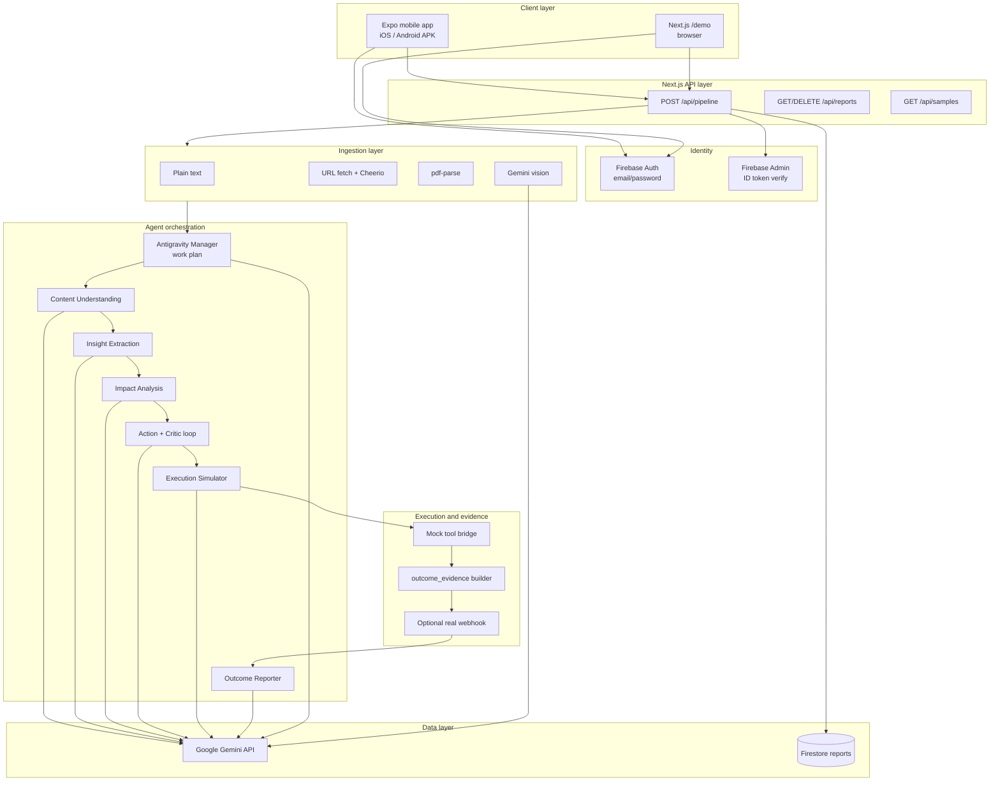

# Autonomous Content-To-Action Agent

**Challenge 1 — Insight → Action:** an agentic system that ingests unstructured content, extracts non-trivial insights, analyzes impact, recommends actions, **simulates execution** of the top path, and surfaces **before/after state**, execution logs, and deterministic **outcome evidence**—with **Google Antigravity–aligned** planning (Manager work plan) and a **mock tool bridge** plus optional **real outbound webhooks**.

| Deliverable | Status |
|-------------|--------|
| Mobile app (required) | Expo (React Native) |
| Web app (optional) | Next.js **`/demo`** (Firebase client env) |
| Agent trace / planning | SSE + `agent_trace` + work plan JSON in response |
| Documentation | This file + [ANTIGRAVITY.md](./ANTIGRAVITY.md) |

### Hackathon submission links

| Item | URL / location |
|------|----------------|
| **Production API** | `https://cta-backend-production.up.railway.app` |
| **Web demo** | `https://cta-backend-production.up.railway.app/demo` (requires Firebase env on host) |
| **Mobile app (APK)** | Built via EAS (`mobile/eas.json`, preview profile); upload public Google Drive link in submission form |
| **Antigravity trace** | [ANTIGRAVITY.md](./ANTIGRAVITY.md) |
| **Source code** | This repository (`backend/` + `mobile/`) |

---

## Table of contents

1. [Overview](#overview)  
2. [Solution design](#solution-design)  
3. [System architecture](#system-architecture)  
4. [Agents developed](#agents-developed)  
5. [Mock vs real APIs and external services](#mock-vs-real-apis-and-external-services)  
6. [Integrations implemented](#integrations-implemented)  
7. [Deployment and environments](#deployment-and-environments)  
8. [How it maps to the challenge brief](#how-it-maps-to-the-challenge-brief)  
9. [Tech stack](#tech-stack)  
10. [Repository layout](#repository-layout)  
11. [Prerequisites](#prerequisites)  
12. [Backend setup](#backend-setup)  
13. [Mobile app setup](#mobile-app-setup)  
14. [Optional web demo (`/demo`)](#optional-web-demo-demo)  
15. [API reference](#api-reference)  
16. [Pipeline stages (runtime)](#pipeline-stages-runtime)  
17. [Google Antigravity (development vs runtime)](#google-antigravity-development-vs-runtime)  
18. [Security and data handling](#security-and-data-handling)  
19. [Scripts and quality checks](#scripts-and-quality-checks)  
20. [Troubleshooting](#troubleshooting)  
21. [Demo video checklist](#demo-video-checklist)  
22. [Assumptions and limitations](#assumptions-and-limitations)  
23. [License](#license)

---

## Overview

Organizations receive floods of unstructured information (reports, news, policy, operational text). Many AI demos stop at summarization. This project goes further:

1. **Understand** normalized content (domain, entities, change, time sensitivity).  
2. **Extract insights** (key facts, main insight, signals, urgency)—prompted to avoid generic summaries.  
3. **Analyze impact** (severity, stakeholders, consequences).  
4. **Generate actions** (ranked recommendations + top action), with an **Action Quality Critic** that can **reject** generic output and trigger **one regeneration** round.  
5. **Simulate execution** (multi-step narrative with tools, notification draft, projected outcomes).  
6. **Validate and visualize outcome** via **`outcome_evidence`**: KPI-style snapshots, field-level diff highlights, and QA flags; plus optional **HTTP POST** to a webhook you control (e.g. webhook.site).

The **mobile app** drives the experience: paste text, enter a URL, pick a PDF, or **upload an image** (chart, screenshot, photo); watch pipeline progress and open a rich **report**. Successful runs are **persisted to Firestore** (per Firebase user). The optional **web demo** (`/demo`) supports the same input modes.

---

## Solution design

### Problem statement

Organizations receive unstructured signals—news, PDFs, dashboards, policy updates, operational reports—and need more than a summary. They need **actionable intelligence**: what changed, who is affected, what to do next, and what happens if the top recommendation is executed.

### Design goals

| Goal | How we address it |
|------|-------------------|
| **Structured reasoning** | Every LLM step uses `generateObject()` + Zod schemas—not free text parsing—so outputs are typed, validated, and composable across agents. |
| **Non-generic insights** | Expert-persona prompts with BAD/GOOD examples, thinking chains, and an **Action Quality Critic** that can reject weak action sets and force one regeneration round. |
| **Verifiable “execution”** | Simulation steps reference named tools; a **mock tool bridge** runs deterministic handlers and emits auditable `audit_line` records with latency and digests. |
| **Observable outcomes** | `outcome_evidence` provides KPI snapshots, before/after diffs, and validation flags; optional **real HTTP webhook** for external systems. |
| **Antigravity alignment** | A **Manager work plan** runs before specialists, mirroring Google Antigravity’s plan → delegate → verify narrative (see [ANTIGRAVITY.md](./ANTIGRAVITY.md)). |
| **Multi-channel input** | Text, public URL, PDF, and **image upload** (vision → text) normalize to one string before the agent chain. |
| **Production-shaped clients** | Expo mobile (required) + Next.js backend; Firebase auth; Firestore history; deployable API (e.g. Railway). |

### End-to-end user journey

1. User signs in (Firebase email/password) on **mobile** or **web demo**.  
2. User submits content via **Text**, **URL**, **PDF**, or **Image**.  
3. Backend **ingests** content into normalized text + metadata.  
4. **Manager** emits a structured work plan (mission, reasoning chain, six planned tasks).  
5. **Six specialist agents** run sequentially; context accumulates in JSON between steps.  
6. **Critic** may reject actions once and trigger regeneration with explicit feedback.  
7. **Simulator** drafts execution steps; **tool bridge** “executes” each tool name.  
8. **Outcome evidence** and optional **webhook** fire; **reporter** produces narrative summaries.  
9. Full **`PipelineResult`** returns to the client; report is saved to **Firestore** (per user).  
10. User reviews the report screen (before/after tables, steps, notification draft, agent trace).

### Key design decisions

- **Sequential agents (not parallel):** Each step needs prior context (e.g. impact depends on insight). Simpler to debug, trace, and stream over SSE.  
- **SSE on web, JSON batch on mobile:** React Native does not reliably stream SSE bodies; mobile uses `stream: false` and replays events from `{ result, events }`.  
- **Sandbox simulation:** No live Gmail/CRM/Sheets in the default path—mock tools avoid credentials and ToS issues while still producing auditable logs.  
- **Single LLM provider (Gemini):** Google AI Studio API via Vercel AI SDK; model default `gemini-2.5-flash` (configurable via `GEMINI_MODEL`).

---

## System architecture

### Logical architecture



### Component responsibilities

| Component | Location | Responsibility |
|-----------|----------|----------------|
| **Mobile app** | `mobile/app/` | Auth UI, four input modes, pipeline progress UI, report/history/settings tabs |
| **API routes** | `backend/src/app/api/` | HTTP entry points, auth gate, SSE/JSON responses |
| **Pipeline orchestrator** | `backend/src/lib/agents/pipeline.ts` | Runs agents in order, emits SSE events, assembles `PipelineResult` |
| **Prompts & schemas** | `prompts.ts`, `schemas.ts` | Persona prompts and Zod shapes for structured Gemini output |
| **Ingestion** | `lib/ingest/` | Normalize text/URL/PDF/image to a single string |
| **Antigravity module** | `lib/antigravity/` | Work plan schema/prompts + mock tool bridge |
| **Webhooks** | `lib/webhooks/` | Optional real outbound POST after simulation |
| **Auth** | `lib/auth.ts` | Verify Firebase Bearer tokens on API routes |
| **Firestore** | `lib/firestore.ts` | Persist and list reports per `userId` |

### Request path (detailed)

```
Client (Firebase ID token in Authorization header)
  → POST /api/pipeline { content, source, stream? }
  → verifyAuth() — Firebase Admin decode; 401 if invalid
  → resolvePipelineContent() — text | url | pdf_base64 | image_base64
  → runPipeline(normalizedText, onEvent, ingestionMeta)
       → emit ingestion_complete
       → workplan_start → generateObject(AntigravityWorkPlan) → workplan_complete
       → for each specialist agent (0..5):
            agent_start → generateObject(schema) → agent_complete | agent_error
       → action loop: generateObject(Action) → critic → optional regeneration
       → generateObject(Simulation) → validate → optional retry
       → executeAntigravityToolBridge() → tool_invocation events
       → buildOutcomeEvidence()
       → dispatchActionWebhook() if ACTION_WEBHOOK_URL set
       → generateObject(OutcomeReport)
       → pipeline_complete(PipelineResult)
  → saveReport(userId, result) — best-effort Firestore write
  → stream ends OR JSON { result, events } returned
```

---

## Agents developed

The system implements **seven LLM-powered roles** (six indexed specialists + one critic) plus **one Manager planning step**. All use **Google Gemini** via `generateObject()` unless noted.

### Manager — Antigravity work plan (pre-pipeline)

| Attribute | Detail |
|-----------|--------|
| **Purpose** | Produce an auditable mission, reasoning chain, and six `planned_tasks` aligned to downstream specialists |
| **Schema** | `AntigravityWorkPlanSchema` (`lib/antigravity/schemas.ts`) |
| **Output fields** | `mission`, `reasoning_chain[]`, `planned_tasks[]` (task_id, title, manager_surface, depends_on, expected_artifact), `tool_integration_notes` |
| **Runs** | Once per pipeline, before Agent 1 |

### Agent 1 — ContentUnderstandingAgent

| Attribute | Detail |
|-----------|--------|
| **Purpose** | Establish domain, entities, detected change, time sensitivity, inferred context |
| **Input** | Normalized content string (+ ingestion metadata in work plan payload) |
| **Output schema** | `ContentUnderstandingSchema` — `domain`, `entities[]`, `change_detected`, `time_sensitivity`, `inferred_context` |
| **Evaluation focus** | Challenge step 1 — content understanding |

### Agent 2 — InsightExtractorAgent

| Attribute | Detail |
|-----------|--------|
| **Purpose** | Extract non-obvious insights—not generic summaries |
| **Input** | Content + Agent 1 output (JSON context) |
| **Output schema** | `InsightSchema` — `key_facts[]`, `main_insight`, `signals[]`, `urgency` (low\|medium\|high\|critical) |
| **Evaluation focus** | Challenge step 2 — insight extraction |

### Agent 3 — ImpactAnalyzerAgent

| Attribute | Detail |
|-----------|--------|
| **Purpose** | Map consequences, severity, stakeholders, estimated impact |
| **Input** | Prior agents’ outputs |
| **Output schema** | `ImpactSchema` — `implications[]`, `severity`, `affected_stakeholders[]`, `estimated_impact`, `consequence_if_ignored` |
| **Evaluation focus** | Challenge step 3 — impact analysis |

### Agent 4 — ActionGeneratorAgent + ActionQualityCritic

| Attribute | Detail |
|-----------|--------|
| **Purpose** | Ranked recommended actions + single `top_action`; critic enforces quality |
| **Loop** | Up to **2 rounds**: generate actions → critic → if `reject` and round &lt; 2, regenerate with `improvement_instructions` |
| **Output schemas** | `ActionSchema`, `ActionCriticSchema` |
| **Trace** | Critic logged as `ActionQualityCritic` in `agent_trace` |
| **Evaluation focus** | Challenge step 4 — action generation |

### Agent 5 — ExecutionSimulatorAgent

| Attribute | Detail |
|-----------|--------|
| **Purpose** | Simulate executing the top action with steps, before/after state, notification draft, projections |
| **Validation** | `validateSimulation()` may trigger **one retry** if before/after or step count is weak |
| **Output schema** | `SimulationSchema` — `steps[]` (with `tool_used`), `before_state`, `after_state`, notification fields, projections |
| **Post-processing** | **Mock tool bridge** runs per step (not LLM) |
| **Evaluation focus** | Challenge step 5 — action simulation |

### Agent 6 — OutcomeReporter

| Attribute | Detail |
|-----------|--------|
| **Purpose** | Human-readable narrative summaries for UI sections |
| **Input** | Full pipeline context including tool invocation audit lines |
| **Output schema** | `OutcomeReportSchema` — summaries for input, insight, impact, actions, simulation |
| **Evaluation focus** | Challenge step 6 — outcome visualization (narrative layer) |

### Non-LLM pipeline steps

| Step | Module | Role |
|------|--------|------|
| **Outcome evidence** | `outcome-evidence.ts` | Deterministic diffs, KPI snapshots, `simulation_validation` flags |
| **Tool bridge** | `antigravity/tool-bridge.ts` | Mock execution records per `tool_used` |
| **Webhook dispatch** | `webhooks/dispatch-action-webhook.ts` | Real HTTP POST when configured |

---

## Mock vs real APIs and external services

### Summary table

| Service / API | Mock or real? | Used for | Configuration |
|---------------|---------------|----------|----------------|
| **Google Gemini** | **Real** | All agent `generateObject` calls + image vision ingestion | `GOOGLE_GENERATIVE_AI_API_KEY` |
| **Firebase Auth** | **Real** | User login (mobile + web) | `EXPO_PUBLIC_FIREBASE_*` / Admin SDK |
| **Firebase Admin** | **Real** | Verify ID tokens on API routes | `FIREBASE_*` in backend `.env.local` |
| **Cloud Firestore** | **Real** | Persist `PipelineResult` per user | Same Firebase project |
| **Public URL fetch** | **Real** | HTML download for `source: url` | Server-side `fetch` + Cheerio |
| **PDF parsing** | **Real** | Text extraction for `source: pdf_base64` | `pdf-parse` library |
| **Image vision** | **Real** | Describe/OCR images → text | Gemini multimodal (`analyze-image.ts`) |
| **Google Sheets** | **Mock** | Simulation step tool | `google_sheets_tool` in tool bridge |
| **Gmail** | **Mock** | Simulation step tool | `gmail_tool` |
| **Google Drive** | **Mock** | Simulation step tool | `google_drive_tool` |
| **Web search** | **Mock** | Simulation step tool | `web_search_tool` |
| **CRM** | **Mock** | Simulation step tool | `crm_tool` |
| **Notifications** | **Mock** | Simulation step tool | `notification_service` |
| **Database tool** | **Mock** | Simulation step tool | `database_tool` |
| **Analytics tool** | **Mock** | Simulation step tool | `analytics_tool` |
| **Outbound action webhook** | **Real (optional)** | POST compact JSON after simulation | `ACTION_WEBHOOK_URL`, `ACTION_WEBHOOK_SECRET` |

### Mock tool bridge behavior

For each simulation step, `executeAntigravityToolBridge()` invokes a **deterministic handler** that returns:

- `latency_ms` (simulated delay)  
- `request_digest` / `response_digest` (truncated descriptions)  
- `audit_line` prefixed with `[MOCK]` for clear sandbox labeling  

Unknown tool names are marked `skipped` with an explanatory audit line—no silent failure.

### Real webhook payload (optional)

When `ACTION_WEBHOOK_URL` is set (e.g. [webhook.site](https://webhook.site)), the server POSTs a **compact JSON** payload including pipeline id, ingestion preview, insight summary, simulation summary, evidence slice, and action quality summary. This is a **real HTTP integration** you can point at Zapier, Discord, or custom backends.

---

## Integrations implemented

### 1. Google Gemini (Vercel AI SDK)

- **Package:** `@ai-sdk/google`, `ai` (`generateObject`, `generateText` for vision)  
- **Default model:** `gemini-2.5-flash` (`GEMINI_MODEL` env override)  
- **Pattern:** Zod schema + prompt per agent; automatic JSON validation  
- **Retries:** `generateObjectWithRetry` handles rate-limit backoffs  

### 2. Firebase (Auth + Firestore)

- **Client:** Mobile (`lib/firebase.ts`) and web demo use Firebase JS SDK  
- **Server:** Firebase Admin verifies Bearer tokens; Firestore stores reports  
- **Security:** API routes reject unauthenticated pipeline/report access  

### 3. Content ingestion integrations

| Mode | Integration | Implementation file |
|------|-------------|-------------------|
| Text | Direct string | `resolve-content.ts` |
| URL | HTTP + HTML parse | `fetch` + Cheerio |
| PDF | Base64 decode + parse | `pdf-parse` |
| Image | Base64 + vision | `analyze-image.ts` → Gemini |

### 4. Mobile ↔ backend

- **Auth:** Firebase ID token sent as `Authorization: Bearer <token>`  
- **Pipeline:** `POST /api/pipeline` with `stream: false` on native (JSON response)  
- **Reports:** `GET /api/reports`, `DELETE /api/reports?id=`  
- **Config:** `EXPO_PUBLIC_API_URL` (e.g. Railway production URL)  

### 5. Google Antigravity (development + runtime parity)

- **Development:** IDE used to architect and implement the repo ([ANTIGRAVITY.md](./ANTIGRAVITY.md))  
- **Runtime:** Work plan + tool bridge + agent trace mirror Antigravity’s Manager → specialists → tools → evidence flow  

### 6. Expo / EAS (mobile distribution)

- **Expo SDK 54** — React Native app with Expo Router  
- **EAS Build** — Android APK for hackathon submission (`eas.json`, preview profile)  
- **Env baked at build:** API URL + Firebase keys in `eas.json` `env` block  

---

## Deployment and environments

| Environment | Backend | Mobile | Notes |
|-------------|---------|--------|-------|
| **Local dev** | `npm run dev` → `http://localhost:3000` | Expo Go / emulator; `EXPO_PUBLIC_API_URL` = LAN IP | Backend binds `0.0.0.0` for device access |
| **Production** | **Railway** — `https://cta-backend-production.up.railway.app` | APK via EAS Build | Team-deployed API; mobile points via `EXPO_PUBLIC_API_URL` |
| **Web demo** | Same backend | Browser `/demo` | Requires `NEXT_PUBLIC_FIREBASE_*` on backend |

### Environment variables (reference)

**Backend (`backend/.env.local`):** `GOOGLE_GENERATIVE_AI_API_KEY`, `FIREBASE_*`, optional `ACTION_WEBHOOK_URL`, `GEMINI_MODEL`  

**Mobile (`mobile/.env` / EAS `env`):** `EXPO_PUBLIC_API_URL`, `EXPO_PUBLIC_FIREBASE_*`  

Secrets must not be committed; use `.env.example` templates.

### Core data model (`PipelineResult`)

The pipeline returns one JSON object (SSE final event or `result` when `stream: false`). Key top-level fields:

| Field | Description |
|-------|-------------|
| `id` | UUID for this run |
| `ingestion` | `ContentIngestionMeta` — source type, char count, `text_preview` |
| `antigravity` | `work_plan` + `tool_invocations[]` from mock bridge |
| `content_understanding` … `simulation` | Outputs from agents 1–5 |
| `action_quality` | Critic verdict, rounds, improvement instructions if any |
| `outcome_evidence` | KPI snapshots, `diff_highlights[]`, `simulation_validation` |
| `webhook_dispatch` | Status of optional outbound POST |
| `outcome_report` | Narrative summaries for UI sections |
| `agent_trace` | Ordered log of agent/critic steps with durations |
| `total_duration_ms` | Wall-clock pipeline time |

Reports are stored in Firestore under the authenticated user's collection for history and delete support via `/api/reports`.

---

## How it maps to the challenge brief

| Brief requirement | Implementation |
|-------------------|----------------|
| **1. Content understanding** (text, PDF, website, **image**, etc.) | `source: "text" \| "url" \| "pdf_base64" \| "image_base64"`; URL fetch + Cheerio HTML→text; `pdf-parse` for PDFs; **Gemini vision** for images → normalized text; `ContentUnderstandingAgent` + Zod schema. |
| **2. Insight extraction** | `InsightExtractorAgent`; structured `key_facts`, `main_insight`, `signals`, `urgency`. |
| **3. Impact analysis** | `ImpactAnalyzerAgent`; implications, severity, stakeholders, consequence if ignored. |
| **4. Action generation** | `ActionGeneratorAgent` + **critic loop** (`ActionQualityCritic`); up to two action rounds. |
| **5. Action simulation (critical)** | `ExecutionSimulatorAgent`; ≥5 steps encouraged; **retry** if validation fails; **mock tool bridge** executes handlers per `tool_used`. |
| **6. Outcome visualization** | Before/after tables, step log, notification draft, **`outcome_evidence`** (diffs, KPIs, validation badges). |
| **7. Agentic workflow** | SSE events; **Antigravity-style work plan** (mission, `reasoning_chain`, `planned_tasks`); `agent_trace`; critic + webhook events. |
| **Google Antigravity** | Primary **development** platform and documented trace ([ANTIGRAVITY.md](./ANTIGRAVITY.md)); **runtime** mirrors [Google’s Antigravity narrative](https://developers.googleblog.com/build-with-google-antigravity-our-new-agentic-development-platform/) (Manager plan → specialists → tools → evidence). |

---

## Tech stack

| Layer | Technology |
|-------|------------|
| **LLM** | Google Gemini via Vercel AI SDK (`@ai-sdk/google`, `generateObject`) |
| **Schemas** | Zod (`schemas.ts`) |
| **Backend** | Next.js 15 App Router, TypeScript |
| **Ingestion** | `fetch` + Cheerio (URL); `pdf-parse` (PDF); **Gemini vision** (`analyze-image.ts`) for images |
| **Auth** | Firebase Auth (client) + Firebase Admin (server) |
| **Persistence** | Cloud Firestore (reports) |
| **Mobile** | Expo SDK 54, React Native, Expo Router, `expo-image-picker` |
| **Streaming** | SSE on web; **JSON batch mode** (`stream: false`) on native Expo clients |

Default model id: **`gemini-2.5-flash`** (override with `GEMINI_MODEL` in `backend/.env.local`). Image ingestion uses the same model for vision.

---

## Repository layout

```
Autonomous_Content_To_Action_Agent/
├── Readme.md                 ← This file
├── ANTIGRAVITY.md            ← Antigravity usage, reasoning trace, judge narrative
├── backend/
│   ├── .env.local.example    ← Copy to .env.local
│   ├── package.json
│   └── src/
│       ├── app/
│       │   ├── api/pipeline/route.ts    ← SSE pipeline entry
│       │   ├── api/reports/route.ts
│       │   ├── api/samples/route.ts
│       │   └── demo/                    ← Optional web demo
│       └── lib/
│           ├── agents/        ← pipeline.ts, prompts, schemas, types, outcome-evidence
│           ├── antigravity/   ← work plan schema, prompts, tool-bridge
│           ├── ingest/        ← resolve-content.ts, analyze-image.ts (URL/PDF/text/image)
│           ├── webhooks/      ← optional ACTION_WEBHOOK_URL dispatch
│           ├── auth.ts
│           └── firestore.ts
└── mobile/
    ├── eas.json               ← EAS Build profiles + production env vars
    ├── package.json
    ├── app/                   ← Expo Router screens (tabs, auth, pipeline, report)
    └── lib/
        ├── api.ts             ← API URL, runPipeline (SSE web / JSON mobile)
        ├── firebase.ts        ← Firebase client (reads `EXPO_PUBLIC_FIREBASE_*` from `.env`)
        ├── .env.example       ← Copy to `.env` (API URL + Firebase; not committed)
        └── theme.ts
```

---

## Prerequisites

- **Node.js** (LTS recommended), **npm**  
- **Google AI Studio / Gemini API key**  
- **Firebase project** with **Email/Password** authentication enabled  
- **Firestore** enabled (rules must allow authenticated user document access as implemented in `firestore.ts`)  
- For **physical Android**: USB debugging or Expo Go; phone and PC on same LAN if using a local backend  

---

## Backend setup

### 1. Install and configure

```bash
cd backend
npm install
cp .env.local.example .env.local
```

Edit **`.env.local`**:

| Variable | Required | Purpose |
|----------|----------|---------|
| `GOOGLE_GENERATIVE_AI_API_KEY` | Yes | Gemini API access |
| `FIREBASE_PROJECT_ID` | Yes | Firebase Admin |
| `FIREBASE_CLIENT_EMAIL` | Yes | Service account email |
| `FIREBASE_PRIVATE_KEY` | Yes | Service account private key (keep quoted; `\n` for newlines) |
| `NEXT_PUBLIC_FIREBASE_*` | For `/demo` only | Firebase JS SDK for web demo |
| `ACTION_WEBHOOK_URL` | No | If set, server POSTs compact JSON after simulation + evidence |
| `ACTION_WEBHOOK_SECRET` | No | If set, sent as header `X-CTA-Webhook-Secret` |

### 2. Run the development server

```bash
npm run dev
```

Default: `http://localhost:3000`. For **phones on the same network**, bind to all interfaces:

```bash
npx next dev -H 0.0.0.0 -p 3000
```

### 3. Production build (sanity check)

```bash
npm run build
npm start
```

### 4. API route limits

`POST /api/pipeline` uses `maxDuration = 300` seconds (Vercel / compatible hosts)—long runs need an appropriate host configuration.

---

## Mobile app setup

### 1. Environment variables

```bash
cd mobile
cp .env.example .env
```

Edit **`mobile/.env`** (gitignored):

| Variable | Purpose |
|----------|---------|
| `EXPO_PUBLIC_API_URL` | Backend base URL (LAN IP for physical device, e.g. `http://192.168.1.42:3000`) |
| `EXPO_PUBLIC_FIREBASE_API_KEY` | Firebase web app config |
| `EXPO_PUBLIC_FIREBASE_AUTH_DOMAIN` | |
| `EXPO_PUBLIC_FIREBASE_PROJECT_ID` | |
| `EXPO_PUBLIC_FIREBASE_STORAGE_BUCKET` | |
| `EXPO_PUBLIC_FIREBASE_MESSAGING_SENDER_ID` | |
| `EXPO_PUBLIC_FIREBASE_APP_ID` | |

Values come from **Firebase Console → Project settings → Your apps → Web app**. Enable **Email/Password** sign-in for the same project the backend Admin SDK uses.

### 2. Backend URL notes

- **Android emulator:** often `http://10.0.2.2:3000` (or set `EXPO_PUBLIC_API_URL` explicitly)  
- **Physical device:** Mac/PC **LAN IP** from `npx expo start` (not `localhost`)  
- **Production:** `https://cta-backend-production.up.railway.app` (or your deployed HTTPS API origin)  

### 3. Install and run

```bash
cd mobile
npm install
npx expo start
```

Press **`a`** for Android emulator or scan the QR code with **Expo Go** (same network as Metro).

### 4. App flow (high level)

- **Auth:** login / register (Firebase).  
- **Analyze (home):** choose **Text**, **URL**, **PDF**, or **Image**; optional inline samples (fuel, finance, supply chain, sales).  
- **Image:** pick from the photo library (JPEG/PNG/WebP/GIF, max ~4MB); server runs **Gemini vision** to extract text and visual context before agents run.  
- **Pipeline:** stages content in AsyncStorage → pipeline screen → **JSON mode** on native (full result + replayed events); web uses SSE.  
- **Report:** full narrative, Antigravity block, simulated ops dashboard, insight/impact/actions, simulation, critic/webhook sections, agent trace.  
- **History / settings:** saved reports and configuration surface as implemented in tabs.

---

## Optional web demo (`/demo`)

1. Set all **`NEXT_PUBLIC_FIREBASE_*`** variables in **`backend/.env.local`** (same Firebase project as mobile web app).  
2. `npm run dev` in `backend/`.  
3. Open **`http://localhost:3000/demo`**.  
4. Sign in with a Firebase email/password user; run pipeline (text, URL, PDF, or **image** upload); SSE lines and final JSON appear in-page.

---

## API reference

### `POST /api/pipeline`

- **Auth:** `Authorization: Bearer <Firebase ID token>`  
- **Body (JSON):**

```json
{
  "content": "<string>",
  "source": "text | url | pdf_base64 | image_base64",
  "stream": true
}
```

- **`content`:** raw text, a full `http(s)` URL, base64-encoded PDF bytes (`pdf_base64`), or base64-encoded image bytes (`image_base64`).  
- **`stream`:** optional; default `true` (SSE). Set `"stream": false` for a single JSON response `{ "result", "events" }` (used by the Expo mobile app).  
- **`image_base64`:** JPEG, PNG, WebP, or GIF; max **4MB**. Server calls Gemini vision once to produce normalized text, then runs the standard agent chain.  
- **Response (stream):** **`text/event-stream`** (SSE). Each event is one line: `data: {JSON}\n\n`.

**Final event:** `type: "pipeline_complete"`, `data` = full **`PipelineResult`** (includes `antigravity`, `outcome_evidence`, `action_quality`, `webhook_dispatch`, `agent_trace`, etc.).

**Error:** `type: "pipeline_error"` with `error` string; HTTP may still be 200 with stream body—check event type on the client.

### CORS

`OPTIONS` and streaming response allow `Access-Control-Allow-Origin: *` for browser demos; production deployments should tighten CORS if needed.

### Other routes

| Method | Path | Notes |
|--------|------|--------|
| GET, DELETE | `/api/reports` | List all reports, `?id=` for one report, or DELETE with `?id=` (Firebase Bearer token) |
| GET | `/api/samples` | Sample content for clients |

---

## SSE event types (chronological reference)

Clients should handle at least: `pipeline_error`, `pipeline_complete`, and optionally UI for:

| Event | Meaning |
|-------|---------|
| `ingestion_complete` | Normalized content metadata (`ContentIngestionMeta`, includes `text_preview` when available) |
| `workplan_start` / `workplan_complete` | Manager-style plan started / finished (`data` = work plan object) |
| `agent_start` / `agent_complete` / `agent_error` | Specialist index 0–5; `data` holds agent output on complete |
| `critic_start` / `critic_complete` | Action critic round |
| `action_regeneration_start` | Critic rejected; regenerating actions |
| `tool_invocation` | One mock tool record after simulation |
| `webhook_dispatch` | Result of optional outbound webhook |
| `pipeline_complete` | Full result |
| `pipeline_error` | Fatal pipeline error |

---

## Pipeline stages (runtime)

1. **Ingestion** — Resolve `text` / `url` / `pdf_base64` / `image_base64` to a single normalized string; images via **Gemini vision** (OCR, charts, visible context); attach `ContentIngestionMeta`.  
2. **Antigravity Manager (work plan)** — Gemini emits `AntigravityWorkPlan`: mission, `reasoning_chain`, `planned_tasks`, `tool_integration_notes`.  
3. **Agent 1 — Content understanding**  
4. **Agent 2 — Insight extraction**  
5. **Agent 3 — Impact analysis**  
6. **Agent 4 — Action generation + critic** — Up to two rounds: generate → critic → if `reject` and round &lt; 2, regenerate with critic feedback.  
7. **Agent 5 — Execution simulator** — Structured simulation; validation may trigger **retry** once for weak before/after or step count.  
8. **Tool bridge** — Deterministic mock handlers for known `tool_used` values (latency, digests, `audit_line`).  
9. **Outcome evidence** — Diffs, KPI snapshots, `simulation_validation` warnings.  
10. **Webhook** — If `ACTION_WEBHOOK_URL` is set, POST a **compact** JSON payload (pipeline id, ingestion preview, insight line, simulation summary, evidence slice, action quality summary).  
11. **Agent 6 — Outcome reporter** — Narrative summaries for the report UI.  
12. **Assemble `PipelineResult`** — Stable `id` (UUID), `total_duration_ms`, full trace.

Specialist display names (SSE `agent` field when indexed):  
`ContentUnderstandingAgent`, `InsightExtractorAgent`, `ImpactAnalyzerAgent`, `ActionGeneratorAgent`, `ExecutionSimulatorAgent`, `OutcomeReporter`.  
The critic appears as **`ActionQualityCritic`** entries inside `agent_trace`.

---

## Google Antigravity (development vs runtime)

- **Development:** This repository was built and refined using **Google Antigravity** (Agent Manager, multi-step sessions, artifacts). Evidence and narrative: **[ANTIGRAVITY.md](./ANTIGRAVITY.md)**.  
- **Runtime product:** The live server executes **`pipeline.ts`** (Next.js). It **implements** the same *class* of workflow Google describes for Antigravity (plan → execute → tool effects → verifiable outputs): structured **work plan**, specialist chain, **executed** mock tools with auditable rows, deterministic **outcome evidence**, optional real webhook.

For hackathon judges: combine **ANTIGRAVITY.md** + short **screen recording of Antigravity** on this repo with the **running app** showing the same work plan and trace.

---

## Security and data handling

- **No real CRM/email** in simulation—mock handlers only unless you deliberately configure a **test** webhook URL you own.  
- **Service account keys** must never ship in the mobile app; only the **backend** uses Admin SDK.  
- **User content** is sent to **Google Gemini** for inference; do not submit real personal or regulated data for demos.  
- **Firestore** stores full `PipelineResult` per user as implemented—apply production security rules and retention policies before wide deployment.

---

## Scripts and quality checks

| Location | Command | Purpose |
|----------|---------|---------|
| `backend/` | `npm run dev` | Next.js development |
| `backend/` | `npm run build` | Production build + typecheck |
| `backend/` | `npm run lint` | ESLint (if configured) |
| `mobile/` | `npx expo start` | Metro + Expo |
| `mobile/` | `npx tsc --noEmit` | Typecheck only |

---

## Troubleshooting

| Symptom | Likely cause | Fix |
|---------|----------------|-----|
| Mobile cannot reach API | `localhost` on device | Use LAN IP or `10.0.2.2` (emulator); run `next dev -H 0.0.0.0` |
| 401 on pipeline | Missing/invalid Firebase token | Log in again; align Firebase project with backend Admin |
| URL ingestion fails | Blocked site, non-HTML, timeout | Try a simple public article URL; check backend logs |
| PDF fails | Image-only or scanned PDF | Use text-based PDF, or **Image** mode for a photo of the page |
| Image fails | Too large or quota | Keep under 4MB; wait for Gemini rate limit; check vision model in `GEMINI_MODEL` |
| Webhook skipped | Env not set | Set `ACTION_WEBHOOK_URL` in `backend/.env.local` |
| Gemini 429 / quota | Free-tier limits | Wait 1–2 min; use `gemini-2.5-flash`; see [rate limits](https://ai.google.dev/gemini-api/docs/rate-limits) |
| Slow or 504 | Long Gemini runs | Normal on cold start; image runs add one vision call before agents |

---

## Demo video checklist (3–5 minutes)

1. **Disclaimer:** Sandbox simulation; no production CRM; optional webhook only to your test URL.  
2. **Input:** Show **four modes** if possible: sample text, **URL**, **PDF**, or **image** (chart/screenshot).  
3. **Pipeline UI:** Work plan → agents → critic line / regeneration if shown → tool audit → webhook line.  
4. **Report:** Before/after tables, steps, **outcome_evidence** badges, one **diff** line, notification draft.  
5. **Antigravity:** Brief IDE/Manager clip + pointer to **ANTIGRAVITY.md** or same work plan on screen.

---

## Assumptions and limitations

- **Public HTTP(S) URLs** only for fetch; respect site `robots`/ToS ethically for demos.  
- **PDF:** best results with text-based PDFs; very large files are capped (see `resolve-content.ts`).  
- **Images:** charts, dashboards, screenshots, and document photos work well; analysis is via **vision → text** (not pixel-level BI integration). Max **4MB** per upload.  
- **Live BI tools** are not connected directly—export a screenshot/chart image or use a public dashboard URL when applicable.  
- **Model output quality** varies with prompt and input; use curated samples for judging.  
- **Antigravity IDE** does not automatically receive logs from every end-user app request; **SSE + `agent_trace`** are the canonical runtime logs for the shipped product.

---

## License

MIT
