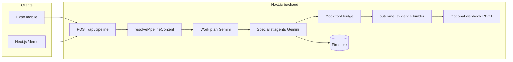

# Autonomous Content-To-Action Agent

**Challenge 1 — Insight → Action:** an agentic system that ingests unstructured content, extracts non-trivial insights, analyzes impact, recommends actions, **simulates execution** of the top path, and surfaces **before/after state**, execution logs, and deterministic **outcome evidence**—with **Google Antigravity–aligned** planning (Manager work plan) and a **mock tool bridge** plus optional **real outbound webhooks**.

| Deliverable | Status |
|-------------|--------|
| Mobile app (required) | Expo (React Native) |
| Web app (optional) | Next.js **`/demo`** (Firebase client env) |
| Agent trace / planning | SSE + `agent_trace` + work plan JSON in response |
| Documentation | This file + [ANTIGRAVITY.md](./ANTIGRAVITY.md) |

---

## Table of contents

1. [Overview](#overview)  
2. [How it maps to the challenge brief](#how-it-maps-to-the-challenge-brief)  
3. [Architecture](#architecture)  
4. [Tech stack](#tech-stack)  
5. [Repository layout](#repository-layout)  
6. [Prerequisites](#prerequisites)  
7. [Backend setup](#backend-setup)  
8. [Mobile app setup](#mobile-app-setup)  
9. [Optional web demo (`/demo`)](#optional-web-demo-demo)  
10. [API reference](#api-reference)  
11. [Pipeline stages (runtime)](#pipeline-stages-runtime)  
12. [Google Antigravity (development vs runtime)](#google-antigravity-development-vs-runtime)  
13. [Security and data handling](#security-and-data-handling)  
14. [Scripts and quality checks](#scripts-and-quality-checks)  
15. [Troubleshooting](#troubleshooting)  
16. [Demo video checklist](#demo-video-checklist)  
17. [Assumptions and limitations](#assumptions-and-limitations)  
18. [License](#license)

---

## Overview

Organizations receive floods of unstructured information (reports, news, policy, operational text). Many AI demos stop at summarization. This project goes further:

1. **Understand** normalized content (domain, entities, change, time sensitivity).  
2. **Extract insights** (key facts, main insight, signals, urgency)—prompted to avoid generic summaries.  
3. **Analyze impact** (severity, stakeholders, consequences).  
4. **Generate actions** (ranked recommendations + top action), with an **Action Quality Critic** that can **reject** generic output and trigger **one regeneration** round.  
5. **Simulate execution** (multi-step narrative with tools, notification draft, projected outcomes).  
6. **Validate and visualize outcome** via **`outcome_evidence`**: KPI-style snapshots, field-level diff highlights, and QA flags; plus optional **HTTP POST** to a webhook you control (e.g. webhook.site).

The **mobile app** drives the experience: paste text, enter a URL, or pick a PDF; watch **Server-Sent Events (SSE)** as the pipeline runs; open a rich **report**. Successful runs are **persisted to Firestore** (per Firebase user).

---

## How it maps to the challenge brief

| Brief requirement | Implementation |
|-------------------|----------------|
| **1. Content understanding** (text, PDF, website, etc.) | `source: "text" \| "url" \| "pdf_base64"`; URL fetch + Cheerio HTML→text; `pdf-parse` for PDFs; `ContentUnderstandingAgent` + Zod schema. |
| **2. Insight extraction** | `InsightExtractorAgent`; structured `key_facts`, `main_insight`, `signals`, `urgency`. |
| **3. Impact analysis** | `ImpactAnalyzerAgent`; implications, severity, stakeholders, consequence if ignored. |
| **4. Action generation** | `ActionGeneratorAgent` + **critic loop** (`ActionQualityCritic`); up to two action rounds. |
| **5. Action simulation (critical)** | `ExecutionSimulatorAgent`; ≥5 steps encouraged; **retry** if validation fails; **mock tool bridge** executes handlers per `tool_used`. |
| **6. Outcome visualization** | Before/after tables, step log, notification draft, **`outcome_evidence`** (diffs, KPIs, validation badges). |
| **7. Agentic workflow** | SSE events; **Antigravity-style work plan** (mission, `reasoning_chain`, `planned_tasks`); `agent_trace`; critic + webhook events. |
| **Google Antigravity** | Primary **development** platform and documented trace ([ANTIGRAVITY.md](./ANTIGRAVITY.md)); **runtime** mirrors [Google’s Antigravity narrative](https://developers.googleblog.com/build-with-google-antigravity-our-new-agentic-development-platform/) (Manager plan → specialists → tools → evidence). |

---

## Architecture



**Request path (simplified):**

```
Client (Firebase ID token)
  → POST /api/pipeline { content, source }
  → Auth middleware (Firebase Admin)
  → Ingestion (text / URL / PDF → normalized string + ContentIngestionMeta)
  → SSE stream opens
  → Work plan (structured “Manager” step)
  → Agents 1–6 + critic loop + simulation + tool bridge + outcome evidence + webhook
  → pipeline_complete (full PipelineResult JSON)
  → Firestore saveReport (best-effort; pipeline still succeeds if save fails)
```

---

## Tech stack

| Layer | Technology |
|-------|------------|
| **LLM** | Google Gemini via Vercel AI SDK (`@ai-sdk/google`, `generateObject`) |
| **Schemas** | Zod (`schemas.ts`) |
| **Backend** | Next.js 15 App Router, TypeScript |
| **Ingestion** | `fetch` + Cheerio (URL); `pdf-parse` (PDF) |
| **Auth** | Firebase Auth (client) + Firebase Admin (server) |
| **Persistence** | Cloud Firestore (reports) |
| **Mobile** | Expo SDK 52, React Native, Expo Router |
| **Streaming** | SSE (`text/event-stream`) |

Default model id in code: **`gemini-1.5-pro`** (see `backend/src/lib/agents/pipeline.ts`).

---

## Repository layout

```
Autonomous_Content_To_Action_Agent/
├── Readme.md                 ← This file
├── ANTIGRAVITY.md            ← Antigravity usage, reasoning trace, judge narrative
├── backend/
│   ├── .env.local.example    ← Copy to .env.local
│   ├── package.json
│   └── src/
│       ├── app/
│       │   ├── api/pipeline/route.ts    ← SSE pipeline entry
│       │   ├── api/reports/route.ts
│       │   ├── api/samples/route.ts
│       │   └── demo/                    ← Optional web demo
│       └── lib/
│           ├── agents/        ← pipeline.ts, prompts, schemas, types, outcome-evidence
│           ├── antigravity/   ← work plan schema, prompts, tool-bridge
│           ├── ingest/        ← resolve-content.ts (URL/PDF/text)
│           ├── webhooks/      ← optional ACTION_WEBHOOK_URL dispatch
│           ├── auth.ts
│           └── firestore.ts
└── mobile/
    ├── package.json
    ├── app/                   ← Expo Router screens (tabs, auth, pipeline, report)
    └── lib/
        ├── api.ts             ← API_BASE_URL, runPipeline SSE client
        ├── firebase.ts        ← Client Firebase config (must fill in)
        └── theme.ts
```

---

## Prerequisites

- **Node.js** (LTS recommended), **npm**  
- **Google AI Studio / Gemini API key**  
- **Firebase project** with **Email/Password** authentication enabled  
- **Firestore** enabled (rules must allow authenticated user document access as implemented in `firestore.ts`)  
- For **physical Android**: USB debugging or Expo Go; phone and PC on same LAN if using a local backend  

---

## Backend setup

### 1. Install and configure

```bash
cd backend
npm install
cp .env.local.example .env.local
```

Edit **`.env.local`**:

| Variable | Required | Purpose |
|----------|----------|---------|
| `GOOGLE_GENERATIVE_AI_API_KEY` | Yes | Gemini API access |
| `FIREBASE_PROJECT_ID` | Yes | Firebase Admin |
| `FIREBASE_CLIENT_EMAIL` | Yes | Service account email |
| `FIREBASE_PRIVATE_KEY` | Yes | Service account private key (keep quoted; `\n` for newlines) |
| `NEXT_PUBLIC_FIREBASE_*` | For `/demo` only | Firebase JS SDK for web demo |
| `ACTION_WEBHOOK_URL` | No | If set, server POSTs compact JSON after simulation + evidence |
| `ACTION_WEBHOOK_SECRET` | No | If set, sent as header `X-CTA-Webhook-Secret` |

### 2. Run the development server

```bash
npm run dev
```

Default: `http://localhost:3000`. For **phones on the same network**, bind to all interfaces:

```bash
npx next dev -H 0.0.0.0 -p 3000
```

### 3. Production build (sanity check)

```bash
npm run build
npm start
```

### 4. API route limits

`POST /api/pipeline` uses `maxDuration = 120` seconds (Vercel / compatible hosts)—long runs need an appropriate host configuration.

---

## Mobile app setup

### 1. Firebase client

Edit **`mobile/lib/firebase.ts`**: replace placeholders with your **Web app** config from Firebase Console (compatible with Expo / Firebase JS SDK).

Enable **Email/Password** sign-in for the same project the backend Admin SDK uses.

### 2. Backend URL

Edit **`mobile/lib/api.ts`**:

- **Android emulator** reaching host machine: often `http://10.0.2.2:3000`  
- **Physical device** on same Wi‑Fi: your computer’s **LAN IP**, e.g. `http://192.168.1.42:3000` (not `localhost`)  
- **Production**: your deployed HTTPS API origin  

### 3. Install and run

```bash
cd mobile
npm install
npx expo start
```

Press **`a`** for Android emulator or scan the QR code with **Expo Go** (same network as Metro).

### 4. App flow (high level)

- **Auth:** login / register (Firebase).  
- **Analyze (home):** choose **Text**, **URL**, or **PDF**; optional inline samples (fuel, finance, supply chain, sales).  
- **Pipeline:** stages content in AsyncStorage → navigates to pipeline screen → consumes SSE until `pipeline_complete`.  
- **Report:** full narrative, Antigravity block, simulated ops dashboard, insight/impact/actions, simulation, critic/webhook sections, agent trace.  
- **History / settings:** saved reports and configuration surface as implemented in tabs.

---

## Optional web demo (`/demo`)

1. Set all **`NEXT_PUBLIC_FIREBASE_*`** variables in **`backend/.env.local`** (same Firebase project as mobile web app).  
2. `npm run dev` in `backend/`.  
3. Open **`http://localhost:3000/demo`**.  
4. Sign in with a Firebase email/password user; run pipeline; SSE lines and final JSON appear in-page.

---

## API reference

### `POST /api/pipeline`

- **Auth:** `Authorization: Bearer <Firebase ID token>`  
- **Body (JSON):**

```json
{
  "content": "<string>",
  "source": "text | url | pdf_base64"
}
```

- **`content`:** raw text, a full `http(s)` URL, or base64-encoded PDF bytes (for `pdf_base64`).  
- **Response:** **`text/event-stream`** (SSE). Each event is one line: `data: {JSON}\n\n`.

**Final event:** `type: "pipeline_complete"`, `data` = full **`PipelineResult`** (includes `antigravity`, `outcome_evidence`, `action_quality`, `webhook_dispatch`, `agent_trace`, etc.).

**Error:** `type: "pipeline_error"` with `error` string; HTTP may still be 200 with stream body—check event type on the client.

### CORS

`OPTIONS` and streaming response allow `Access-Control-Allow-Origin: *` for browser demos; production deployments should tighten CORS if needed.

### Other routes

| Method | Path | Notes |
|--------|------|--------|
| GET, DELETE | `/api/reports` | List all reports, `?id=` for one report, or DELETE with `?id=` (Firebase Bearer token) |
| GET | `/api/samples` | Sample content for clients |

---

## SSE event types (chronological reference)

Clients should handle at least: `pipeline_error`, `pipeline_complete`, and optionally UI for:

| Event | Meaning |
|-------|---------|
| `ingestion_complete` | Normalized content metadata (`ContentIngestionMeta`, includes `text_preview` when available) |
| `workplan_start` / `workplan_complete` | Manager-style plan started / finished (`data` = work plan object) |
| `agent_start` / `agent_complete` / `agent_error` | Specialist index 0–5; `data` holds agent output on complete |
| `critic_start` / `critic_complete` | Action critic round |
| `action_regeneration_start` | Critic rejected; regenerating actions |
| `tool_invocation` | One mock tool record after simulation |
| `webhook_dispatch` | Result of optional outbound webhook |
| `pipeline_complete` | Full result |
| `pipeline_error` | Fatal pipeline error |

---

## Pipeline stages (runtime)

1. **Ingestion** — Resolve `text` / `url` / `pdf_base64` to a single normalized string; attach metadata.  
2. **Antigravity Manager (work plan)** — Gemini emits `AntigravityWorkPlan`: mission, `reasoning_chain`, `planned_tasks`, `tool_integration_notes`.  
3. **Agent 1 — Content understanding**  
4. **Agent 2 — Insight extraction**  
5. **Agent 3 — Impact analysis**  
6. **Agent 4 — Action generation + critic** — Up to two rounds: generate → critic → if `reject` and round &lt; 2, regenerate with critic feedback.  
7. **Agent 5 — Execution simulator** — Structured simulation; validation may trigger **retry** once for weak before/after or step count.  
8. **Tool bridge** — Deterministic mock handlers for known `tool_used` values (latency, digests, `audit_line`).  
9. **Outcome evidence** — Diffs, KPI snapshots, `simulation_validation` warnings.  
10. **Webhook** — If `ACTION_WEBHOOK_URL` is set, POST a **compact** JSON payload (pipeline id, ingestion preview, insight line, simulation summary, evidence slice, action quality summary).  
11. **Agent 6 — Outcome reporter** — Narrative summaries for the report UI.  
12. **Assemble `PipelineResult`** — Stable `id` (UUID), `total_duration_ms`, full trace.

Specialist display names (SSE `agent` field when indexed):  
`ContentUnderstandingAgent`, `InsightExtractorAgent`, `ImpactAnalyzerAgent`, `ActionGeneratorAgent`, `ExecutionSimulatorAgent`, `OutcomeReporter`.  
The critic appears as **`ActionQualityCritic`** entries inside `agent_trace`.

---

## Google Antigravity (development vs runtime)

- **Development:** This repository was built and refined using **Google Antigravity** (Agent Manager, multi-step sessions, artifacts). Evidence and narrative: **[ANTIGRAVITY.md](./ANTIGRAVITY.md)**.  
- **Runtime product:** The live server executes **`pipeline.ts`** (Next.js). It **implements** the same *class* of workflow Google describes for Antigravity (plan → execute → tool effects → verifiable outputs): structured **work plan**, specialist chain, **executed** mock tools with auditable rows, deterministic **outcome evidence**, optional real webhook.

For hackathon judges: combine **ANTIGRAVITY.md** + short **screen recording of Antigravity** on this repo with the **running app** showing the same work plan and trace.

---

## Security and data handling

- **No real CRM/email** in simulation—mock handlers only unless you deliberately configure a **test** webhook URL you own.  
- **Service account keys** must never ship in the mobile app; only the **backend** uses Admin SDK.  
- **User content** is sent to **Google Gemini** for inference; do not submit real personal or regulated data for demos.  
- **Firestore** stores full `PipelineResult` per user as implemented—apply production security rules and retention policies before wide deployment.

---

## Scripts and quality checks

| Location | Command | Purpose |
|----------|---------|---------|
| `backend/` | `npm run dev` | Next.js development |
| `backend/` | `npm run build` | Production build + typecheck |
| `backend/` | `npm run lint` | ESLint (if configured) |
| `mobile/` | `npx expo start` | Metro + Expo |
| `mobile/` | `npx tsc --noEmit` | Typecheck only |

---

## Troubleshooting

| Symptom | Likely cause | Fix |
|---------|----------------|-----|
| Mobile cannot reach API | `localhost` on device | Use LAN IP or `10.0.2.2` (emulator); run `next dev -H 0.0.0.0` |
| 401 on pipeline | Missing/invalid Firebase token | Log in again; align Firebase project with backend Admin |
| URL ingestion fails | Blocked site, non-HTML, timeout | Try a simple public article URL; check backend logs |
| PDF fails | Image-only or scanned PDF | Use text-based PDF |
| Webhook skipped | Env not set | Set `ACTION_WEBHOOK_URL` in `backend/.env.local` |
| Slow or 504 | Long Gemini runs | Normal on cold start; ensure host allows long serverless duration |

---

## Demo video checklist (3–5 minutes)

1. **Disclaimer:** Sandbox simulation; no production CRM; optional webhook only to your test URL.  
2. **Input:** Show **three modes** if possible: sample text, **URL**, or **PDF**.  
3. **Pipeline UI:** Work plan → agents → critic line / regeneration if shown → tool audit → webhook line.  
4. **Report:** Before/after tables, steps, **outcome_evidence** badges, one **diff** line, notification draft.  
5. **Antigravity:** Brief IDE/Manager clip + pointer to **ANTIGRAVITY.md** or same work plan on screen.

---

## Assumptions and limitations

- **Public HTTP(S) URLs** only for fetch; respect site `robots`/ToS ethically for demos.  
- **PDF:** best results with text-based PDFs; very large files are capped (see `resolve-content.ts`).  
- **Dashboards as images** or live BI tools are **not** ingested—use exported PDF/text or a public HTML dashboard URL when applicable.  
- **Model output quality** varies with prompt and input; use curated samples for judging.  
- **Antigravity IDE** does not automatically receive logs from every end-user app request; **SSE + `agent_trace`** are the canonical runtime logs for the shipped product.

---

## License

MIT
